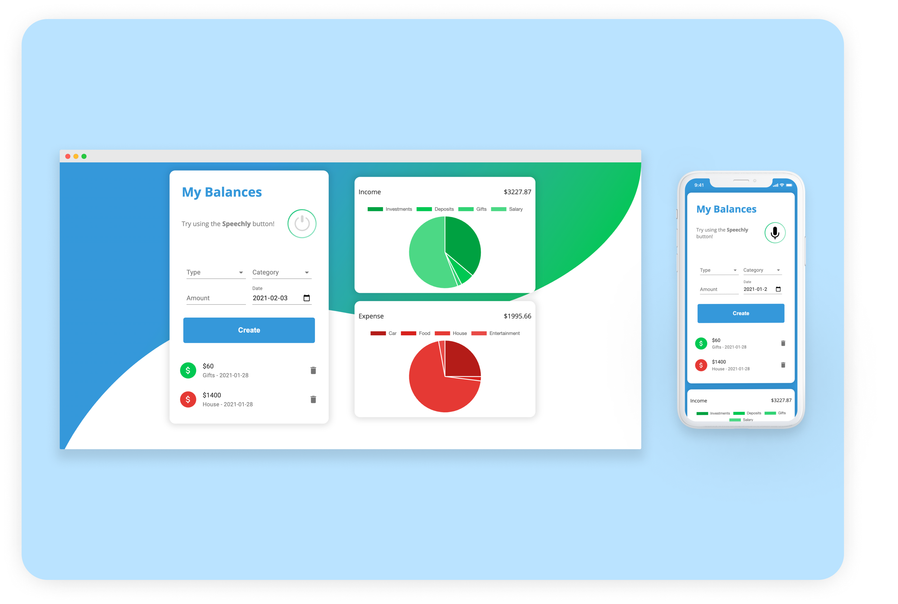

<!-- PROJECT LOGO -->
<br />
<p align="center">

  <h1 align="center">Profitry - Income & Expense Tracker</h1>

  <p align="center">
    A single-page application that integrates Speechly to track income and expenses. 
</p>

<!-- ABOUT THE PROJECT -->

## About The Project

MVP Features:

- Track income and expenses based off a variety of categories
- Integrated [Speechly](https://www.speechly.com), which enables the application to have a voice-enabled UI to input information.

- Responsive for both mobile and desktop devices

This was a fun little project to hone in on my frontend development skills using React and external libraries/frameworks. In the future, I hope to connect a backend with a database instead of using local storage.

### Built With

- [React](https://reactjs.org)
- [Material-UI](https://material-ui.com)
- [Chart.js](https://www.chartjs.org)

### Getting Started & Installation

1. Clone the repo
   ```sh
   git clone https://github.com/your_username_/Project-Name.git
   ```
2. Install NPM packages
   ```sh
   npm install or yarn install
   ```

## Screenshots


